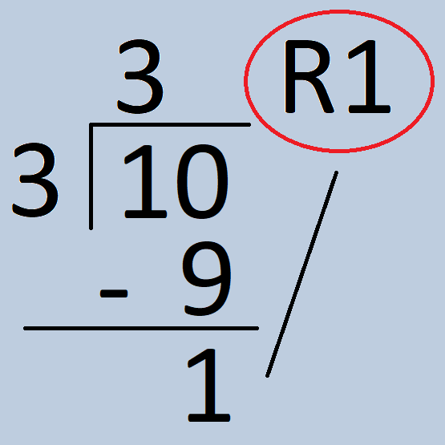

# Doing Math in Python
* You can do math in Python just like you would in your math class, using symbols for basic operations:
  * For example: `a = 5 + 3` causes `8` (5 + 3) to be assigned to the variable `a`.
    * The symbols (5 and 3) on the sides of the operator (+) are called  __operands__
* Basic math rules still apply!
  * Division by zero displays an error

| Python Syntax | Operation | Math Symbol | Example | Result |
| :-: | :-: | :-: | :-: | :-: |
| `+` | Addition | + | `5 + 2` | `7` |
| `-` | Subtraction | − | `6 - 4` | `2` |
| `*` | Multiplication | × | `4 * 3` | `12` |
| `/` | Division | ÷ | `8 / 4` | `2` |

## Advanced Operators

* There are other operators that may be more unfamiliar:
  * **Integer (Floor) division** (`//`)
    * Gives the  __whole number result__  of a division operation between two integers or floats
      * 11 divided by 4  __is 2__  with a remainder of 3
      * `11 // 4`  __equals 2__ * Truncates the quotient that you would get when you perform normal division with those numbers(the .75 of 11 / 4 gets removed when you do `11 // 4`)

### Modulus (`%`)
* Gives the  __remainder __ of a division operation between two integers (whole numbers) or floats
  * 11 divided by 4 is 2 with a  __remainder of 3__
  * `11 % 4`  __equals 3__
* Modulus operator of the form x % y where x < y always results in x
  * x / y will be 0 so the remainder has to be x
  * 3 % 13  __equals 3__

10 % 3 = 1



* Uses for modulus
  * Checking whether a number is even or odd
  * Converting between different bases
  * Check whether a number is divisible by a certain value

### Exponent  (`**`)
* Raises the left operand to the power of the right operand
  * Three raised to the fifth power equals 243
	* 35 = 243
  * `3 ** 5` equals 243
* **Do NOT use ^ to do exponent. ^ is a different operator and means something completely different.**
* Cannot divide by zero with integer division either

| Python Syntax | Operation | Math Symbol | Example | Result |
| :-: | :-: | :-: | :-: | :-: |
| `//` | Integer Division | None | `13 // 4` | `3` |
| `%` | Modulus | `%` | `17 % 4` | `1` |
| `**` | Exponent | Superscript | `5 ** 2` | `25` |


## Reference: Arithmetic Operators
For the table, a is 10 and b is 20

| Symbol | Operator | Definition | Example |
| :-: | :-: | :-: | :-: |
| +  | Addition | Adds values on either side of the operator. | a + b = 30 |
| -  | Subtraction | Subtracts right hand operand from left hand operand. | a – b = -10 |
| *  | Multiplication | Multiplies values on either side of the operator | a * b = 200 |
| / | Division | Divides left hand operand by right hand operand | b / a = 2 |
| %  | Modulus | Divides left hand operand by right hand operand and returns remainder | b % a = 0 |
| **  | Exponent | Performs exponential (power) calculation on operators | a ** b = 1020 |

# Rounding floats
* When casting from a float to an int, the value does not round, it  __truncates__ the decimal is just removed without any rounding. 
* To properly round, use the `round()` function
  * `round(number)`

```python
a = int(3.8) # a is 3

b = int(3.1) # b is 3

a = round(3.8) #a is 4

b = round(3.1) #b is 3
```

# Example: Math Machine

This code asks for two numbers and prints out the result of every operation we have learned:  _[replit.com/@returnSTEM/MathMachine](https://replit.com/@returnSTEM/MathMachine)_

```python
first = input("Enter your first number: ")  # Inputs the numbers to be calculated
second = input("Enter your second number: ")

first = int(first)  # Typecast input strings to integers
second = int(second)

result = first + second  # Addition
print("Result:", first, "+", second, "=", result)  # Output Formatting

result = first - second  # Subtraction
print("Result:", first, "-", second, "=", result)  # Output Formatting

result = first * second  # Multiplication
print("Result:", first, "*", second, "=", result)  # Output Formatting

result = first / second  # Division
print("Result:", first, "/", second, "=", result)  # Output Formatting

result = first // second  # Integer Division
print("Result:", first, "//", second, "=", result)  # Output Formatting

result = first % second  # Modulus
print("Result:", first, "%", second, "=", result)  # Output Formatting

result = first**second  # Exponent
print("Result:", first, "**", second, "=", result)  # Output Formatting
```

# Order of Operations

* Python has an order of operations similar to arithmetic:  __P E M/D A/S__
  * Expressions are evaluated from left to right for each level of PEMDAS
* P: Items inside  __parenthesis__ will be evaluated first
* E:  __Exponents__  will then be evaluated
* MD: Multiplication, division,  __modulus, integer division__  all have the same priority
* AS: Finally, addition and subtraction is evaluated
## Example
* Evaluate `3 * 5 ** 2 + (4 + 3 - 2) // 3 % 4`
  * Parenthesis: `(4 + 3 - 2)`
    * Addition and subtraction is on the same level, so evaluate left to right
      * `4 + 3 = 7`, `7 - 2 = 5`
* `3 * 5 ** 2 + 5 // 3 % 4`
  * Exponent: `5 ** 2 = 52 = 25`
* `3 * 25 + 5 // 3 % 4`
  * Multiplication, division, modulus, integer division
    * Multiplication, integer division, modulus are on the same level, so evaluate left to right
      * `3 * 25 = 75`
        * `75 + 5 // 3 % 4`
      * `5 // 3 = 1`
        * `75 + 1 % 4`
      * `1 % 4 = 1`
        * `75 + 1`
* `75 + 1`
  * Addition: `75 + 1 = 76`


## Let’s Practice

Evaluate each of the python expressions:

`1 + 2 * 3 / 4.0`
`2 ** 8`
`1000 % 365`
`80 % 400`
`480 % 400.0`
`880 % 400`
`8 * 6 - 7 ** 2`

# Equation Building

* You can just variables as operands, as well as in conjunction with numbers
* Useful when writing programs where you need to:
  * Take input from a user (the variable value will need to change)
  * Use longer numbers (using a variable called pi is much shorter than typing out  3.141592653589793 every time you want to use it)
* Makes code more readable/understandable
    * Using a specific name for a value is useful(especially when others read your code)
    * Better to use a variable instead of the number each time it is used
    * This is helps keep track of many different values when you are working with math
```python
a = 4

b = 5

c = a**b  #Store the value that is

#equal to 4**5 in c

print(c)

>>> 1024
```

```python
a = 4       #Assign 4 to a
b = 5       #assign 5 to b

c = a + b   #store the sum of a and b in c

print(c)
>>> 9
```

# Modules

* To reduce the size of Python, it is divided into many parts that can be included as needed, called modules
* Python has many __modules__ , portions of pre-written code that we can use in our programs
  * These modules can save time by doing a lot of the work for us
  * Modules can be __imported__ , or brought into our project for our use
* Modules exist for many tasks, and can save you a lot of time when writing code


* One important module is called math, which you can use for float operations and other functions
* To import a module, we use the keyword “import”
* Modules can be thought of as a subscription for an app
  * To use certain features you need to purchase a subscription or in this case import the module
* Other modules include: date time(working with dates/times), random, etc.

## Float operations

* Floats can be converted to integers by always rounding up or always rounding down
  * Example:
    * If you have enough batter for 4.65 cookies, you can only practically make 4 whole cookies (always round down, "floor" function)
    * If you have to transport 10 people and each car only holds 4 people, you will need 3 cars, not 2.5 (always round up, "ceiling" function)
  * To do this, we need the  __math__  module, which can be imported using this statement at the top of your file:
    * import math
  * From there, you can use `math.floor()` (down) and `math.ceil() (up)`

```
import math

math.floor(5.9) → 5

math.floor(2.1) → 2

math.ceil(3.3) → 4

math.ceil(8.999) → 9
```

## The `math` Module

* `math.sqrt(x)`
  * returns the square root of the integer/float x as a float
* `math.fabs(x)`
  * returns the absolute value of x
* `math.factorial(x)`
  * returns the factorial of x, if x is not an integer or is negative, raises an error
* `math.gcd(x,y)`
  * Returns the greatest common divisor of x and y, if either is not an integer, raises an error
* `math.pi`
  * Evaluates to the digits of pi
* `math.e`
  * Evaluates to the digits of e (it's ok if you don't know this number, you'll learn it later in math class)
* For constants in Python, don't add parentheses ()


```
import math

math.sqrt(4)
>>> 2.0

math.sqrt(-4)
>>> ValueError

math.fabs(2)
>>> 2.0

math.fabs(-2)
>>> 2.0

math.factorial(7)
>>> 5040

math.factorial(6.3)
>>> ValueError

math.sqrt(3)
>>> 1.7320508075688772

math.gcd(75, 35)
>>> 5

math.pi
>>> 3.141592653589793

math.e
>>> 2.718281828459045
```


_[List of Math Functions in Python](https://docs.python.org/3/library/math.html)_

## The `random` Module

* `import random` at the top to use the module
* The `random` module is used to generate random data
  * An example of using it would be to generate a the value on a die
* `random.random()`
  * Returns a random  __float__  between 0 and 1
* `random.uniform(x , y)`
  * Returns a random  __float __ in the range x - y
* `random.randint(x , y)`
  * Returns a random  __integer __ in the range x - y
* The `random` module can also be used to work with lists, which you will learn about later

```
import random

random.random()
>> 0.15074098317978457

random.uniform(1,5)
>>> 2.8951547807157176

random.randint(1,5)
>>> 4
```

__4. Basic Operations__

# The `datetime` Module

* `import datetime` at the top to use the module
* The `datetime` module is used to work with dates/times
* `y=datetime.date(year, month, date)` allows you to make the variable a certain date
* `datetime.date.today()`
  * Returns the local date in the form year-month-date
* If a certain date is assigned to the variable `x`
  * `x.year` returns the year
  * `x.day` returns the day
  * `x.month` returns the month
  * `x.weekday()` returns the day of the week where Monday is 0 and Sunday is 6
* You can subtract dates to find the number of days till a certain date

```
#Program to find days until Christmas

import datetime

y=datetime.date(2021,12,25)

x=datetime.date.today()

print(y-x)
```

# Compound Assignment Operators

In Python, you can add two values and then assign it to the left operand

This is done using the operator used, followed by a =.

| Using =  | Shortcut |
| :-: | :-: |
| a = a + b | a += b |
| a = a - b | a -= b |
| a = a / b | a /= b |
| a = a // b | a //= b |
| a = a * b | a *= b |
| a = a % b | a %= b |
| a = a ** b  | a **= b |

__4. Basic Operations__

# Basic Operations Practice

_Write the following short programs_

Write a program that takes a temperature in Fahrenheit from the console, which it then converts into Celsius.

_Formula:_  $(F - 32) * \frac{5}{9} = C$

Write a program a calculates the area of a rectangle given the length and width _Formula:_  $A = l * w$

**CHALLENGE: Write a program converts seconds to Hours:Minutes:Seconds format.** 

>  _Tip:_ You can use // to do integer division and % find the remainders after you have divided

## Test Cases

| Test Cases for Problem 1  |  |
| :-: | :-: |
| Input | Output |
| 32 | 32 degrees Fahrenheit is 0.0 degrees Celsius. |
| 68 | 68 degrees Fahrenheit is 20.0 degrees Celsius. |
| 130.1 | 130.1 degrees Fahrenheit is 54.5 degrees Celsius. |
| 5 | 5 degrees Fahrenheit is -15.0 degrees Celsius. |


| Test Cases for Problem 2 |  |
| :-: | :-: |
| Input | Output |
| 2<br />3 | The area is 6 meters squared. |
| 23<br />12.5 | The area is 287.5 meters squared. |
| 100<br />23.2 | The area is 2320 meters squared. |
| 55<br />21 | The area is 1155 meters squared. |


| Test Cases for Problem 3 |  |
| :-: | :-: |
| Input | Output |
| 1432 | 0:23:52 |
| 61942 | 17:12:22 |
| 1500 | 0:25:0 |
| 72591 | 20:9:51 |

# Vocabulary

| Word | Definition |
| :-: | :-: |
| Order of Operations | The precedence of various operations in Python. It determines what steps are done first. |
| Arithmetic Operators | Operators that perform mathematical actions on operands |
| Operand | Symbols (variables/numbers) that operators perform actions on |
| Modules | portions of pre-written code that we can use in our programs |
| math | A module which has a large number of mathematical functions that can be imported |

# Python Concepts

| Word | Definition |
| :-: | :-: |
| Integer Division (//) | Gives the whole number result of a division operation between two integers (whole numbers) |
| Modulus (%) | Gives the remainder of a division operation between two integers (whole numbers) |
| Exponent (\*\*) | Raises the left operand to the power of the right operand |
| import | Allows programmers to add, or import, modules in their code |
| math.floor() | rounds floats down |
| math.ceil() | rounds floats up |
| math.sqrt(x) | returns the square root of the integer/float x as a float |
| math.fabs(x) | returns the absolute value of x<br /> |
| math.factorial() | returns the factorial of x, if x is not an integer or is negative, raises an error |
| math.gcd(x,y) | Returns the greatest common divisor of x and y, if either is not an integer, raises an error |
| math.pi | Evaluated to the digits of pi |
| math.e | Evaluates to the digits of e<br /> |
| random.random() | returns a random float between 0 and 1 |
| random.uniform(x, y) | returns a random float in the range x - y |
| random.randint(x, y) | returns the factorial of x, if x is not an integer or is negative, raises an error |
| y=datetime.date(year, month, date) | assigns a date to the variable y |
| datetime.date.today()<br /><br /> | returns the local date |

