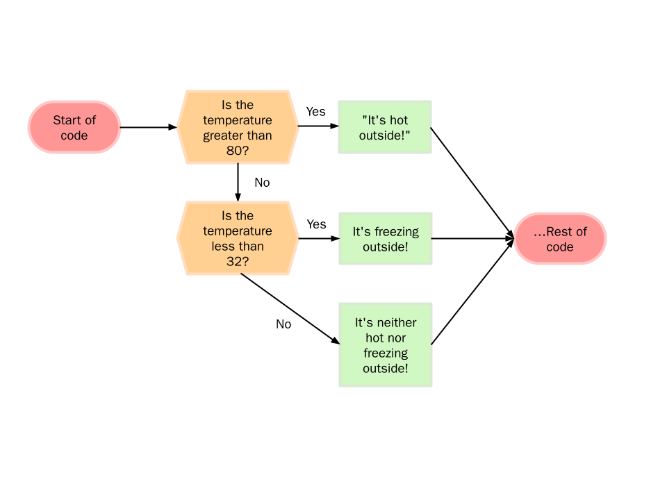
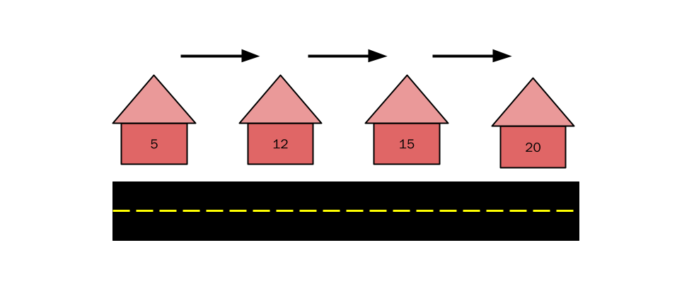
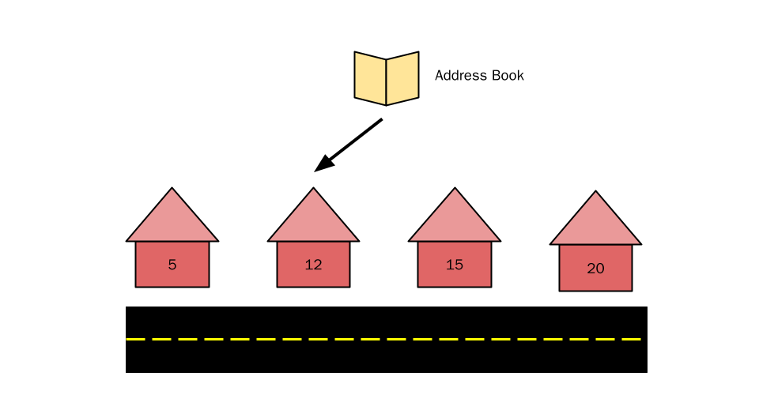

Up until now, you've learned to make **linear** C++ programs, where the program executes from top to bottom. Sometimes the program will take a break to ask for user input, but the way it runs is pretty straightforward.

**Control structures** change that up a bit. This lesson, we'll be showing you how to write programs that decide what code to run. This is called the **control flow** of the program, or which "path" the program takes. Think of it like a fork in the road–you decide to either go right or left. This brings us to our first challenge: figuring out how our computers make decisions.

# How Do Computers Make Decisions?

Computers make decisions a little differently from humans. When I choose what I'll eat for lunch, I need to ask myself a few questions: What do I want? How much am I willing to spend? How convenient is it for me to get it? All these questions have an infinite number of answers.

However, as you might remember from lesson 2, computers operate on an on-or-off basis–this means that each question can only have two answers, `true` or `false`, or 0 or 1. In C++, there's a data type for that–the **boolean**! In summary, each question our program has to answer needs to have a boolean answer, either `true` or `false`.

# Relational Operators

Thankfully, C++ gives us a few predefined "questions" in the form of **relational operators*.*** These compare two pieces of data and give us a **boolean result**–exactly what we're looking for! For simplicity's sake, we will only use relational operators on numbers for now, so we will be comparing the values of numbers. You might recognize some of these from math, they work the same way:

| **Relation**             | **Operator** |
|--------------------------|--------------|
| Equal to                 | `==`       |
| Not equal to             | `!=`       |
| Less than                | `<`       |
| Greater than             | `>`       |
| Less than or equal to    | `<=`      |
| Greater than or equal to | `>=`      |

To use these, we'll have to place two **operands**, one on either side. These work a lot like the arithmetic operators from last lesson. Just as 4 + 5 equals 9, 3 < 4 equals `true`. Here are some examples. Pay attention to what questions they ask and what they evaluate to.

| Code     | Asks this question…                             | Which evaluates to… |
|----------|-------------------------------------------------|---------------------|
| 2 == 3   | Is 2 equal to 3? No.                            | `false`           |
| 3 != 5   | Is 3 not equal to 5? Yes.                       | `true`            |
| 4 < 5   | Is 4 less than 5? Yes.                          | `true`            |
| 10 > 12 | Is 10 greater than 12? No.                      | `false`           |
| 3 <= 3  | Is 3 less than 3 or equal to 3? Yes, equal.     | `true`            |
| 4 >= 5  | Is 4 greater than 5 or equal to 5? No, neither. | `false`           |

Alright, now we have a boolean answer to a question. How do we use it?

# `if` Statements

The `if` statement allows the program to decide whether or not to execute a block of code, depending on a boolean condition. The basic structures looks like this:

```cpp
if (condition) {

}
```

If the boolean condition is `true`, the program will execute everything inside of the curly braces. If the condition isn't `true`, the program simply skips to the next line of code after the if-block (after the closing `}`).

This condition can be **anything that evaluates to a boolean**–a variable, a literal (`true` or `false`), or any of the relational operators mentioned above. The condition should be surrounded by parenthesis, and the code that is run **conditionally** needs to be enclosed inside curly braces:

```cpp
int temperature;
cin >> temperature;

if (temperature > 80) {
    cout << "It's hot outside!" << endl;
}
cout << "Program done." << endl;
```

This code lets a user input a temperature in Fahrenheit and outputs `It's hot outside` if the temperature is greater than 80 degrees. Regardless of what the temperature is, the program will always output `Program done.` This is because the second `cout` isn't part of the `if` statement's code block, so it's executed right after the `if` block is evaluated.

We can use a flowchart to visualize the **control flow** of the program. This is especially useful with more complex programs–you'll see this later


Any amount of code can be put inside an `if` block–it just needs to be enclosed in the curly braces. Also note the indentation–while it's not required by C++, it lets the programmer know what is and isn't inside the `if` block.

# `else` and `else if` clauses

## `else` clause

An `if` statement allows a program to either run or skip over a run of code. What if we wanted the program to choose between two blocks of code to run? The `else` clause can help us do that. When put after an `if` statement, the program will run the code when the condition is **not** met. Let's take our existing temperature code and output something if the temperature is **not greater than** 80:

```cpp
int temperature;
cin >> temperature;

if (temperature > 80) {
    cout << "It's hot outside!" << endl;
}
else {
    cout << "It's not hot outside!" << endl;
}
cout << "Program done." << endl;
```

The `else` clause is placed immediately after the `if` block we want to apply it to. In the code above, if the temperature is greater than 80, the condition is `false` and outputs `It's hot outside!` just like our old code did. If the temperature is less than or equal to 80, the condition becomes `false` and the code in the `else` block is run, which outputs `It's not hot outside!`.

The flowchart looks like this:


## `else if` clauses

The `else if` clause lets us check for another condition of the preceding `if` condition is false. This lets the program make more complex decisions by testing multiple boolean conditions. Let's modify our program to also test if the temperature is below freezing:

```cpp
int temperature;
cin >> temperature;
if (temperature > 80) {
    cout << "It's hot outside!" << endl;
}
else if (temperature < 32) {
    cout << "It's freezing outside!" << endl;
}
else {
    cout << "It's neither hot nor freezing outside!" << endl;
}

cout << "Program done." << endl;
```

The program first checks if the temperature is above 80. If it is, the program outputs `It's hot outside!` and skips to `Program done.` However, if the temperature isn't above 80, the program moves onto the `else if` clause. Here, we test if the temperature is below 32–if it is, `It's freezing outside!` is outputted and we move to `Program done.`

Finally, if the temperature is neither above 80 or below 32, the program outputs `It's neither hot nor freezing outside!` and then moves to `Program done.`

The flowchart looks like this:


The flowchart is a little complex, but the main takeaway here is that **order matters.** We're first checking if the temperature is greater than 80, then we're checking if the temperature is less than 32. This matters sometimes–consider this example:

```cpp
int temperature;
cin >> temperature;

if (temperature > 80) {
    cout << "It's hot outside!" << endl;
}

else if (temperature > 90) {
    cout << "It's really hot outside!" << endl;
}

cout << "Program done." << endl;
```

If we enter `95`, the program outputs `It's hot outside!` because the program first checks if the temperature is greater than 80. It is, so it'll print `It's hot outside!` despite the `else if` clause. If we reverse the order of the conditions, we get different behavior:

```cpp
int temperature;
cin >> temperature;

if (temperature > 90) {
    cout << "It's really hot outside!" << endl;
}
else if (temperature > 80) {
    cout << "It's hot outside!" << endl;
}
cout << "Program done." << endl;
```

Now if we enter `95`, the program outputs `It's really hot outside!` because we **first** check if the temperature is greater than 90, **then** if it isn't, we check if it's greater than 80. Usually this is what we want, so pay attention to the order of `if` clauses.

Another thing to note: in our original code, the undesired behavior only appears when we enter a number between 80 and 90. These errors can be difficult to find since we encounter a problem **only for certain inputs**.

# Boolean Operators

What if we want to check for multiple conditions? This is where boolean operators come in. These allow us to invert and combine conditions to perform more complex logic. C++ has three main boolean operators:

Operator | C++ Syntax | Behavior
-----|-----|-----
NOT | `!` | Inverts the condition
AND | `&&` | `true` only if **both** sides are true
OR | `||` | `true` if **either** side is true

The NOT operator is the simplest: it simply inverts a single boolean condition, turning `true` into `false` and vice versa. AND and OR operate on two boolean conditions, becoming true when **both are true** (AND) or when **either are true** (OR). Here are some examples:

| Code | Evaluates to... | Explanation |
| ---|---|---|
| `!(3 < 5)` | `false` |  `3 < 5` evaluates to `true` and is inverted by NOT, so we get `false`.
| `10 < 20 && 20 > 40` | `false` | `10 < 20` is `true`, but `20 > 40` is `false`. Both need to be `true` for an AND operator to evaluate to `true`, so this expression evaluates to `false`.
| `15 < 20 \|\| 20 == 40` | `true` | `10 < 20` is `true` and `20 == 40` is `false`. Only one boolean condition needs to be true for an OR operator to evaluate to `true`, so this expression evaluates to `true`.

These can be used inside `if` and `else if` clauses just like we'd normally use a condition. This is helpful if we want to check a single variable for multiple conditions, or check multiple variables. Consider this example, where we use the `&&` operator to determine whether a number is between 5 and 20, exclusive:
```cpp
int number;
cin >> number;

if (number > 5 && number < 20) {
    cout << "Between 5 and 20" << endl;
}
else {
	cout << "Not between 5 and 20" << endl;
}
```

Also note the `else` clause. If our number is not greater than 5 and less than 20, then we know that our number is not between 5 and 20. Therefore, another way we could check if a number is between 5 and 20 is checking if it is less than or equal to 5 or greater than or equal to 20, and inverting it with the NOT operator:

```cpp
int number;
cin >> number;

if (!(number <= 5 || number >= 20)) {
    cout << "Between 5 and 20" << endl;
}
else {
	cout << "Not between 5 and 20" << endl;
}
```

Often times with boolean operators, there are multiple ways to accomplish the same thing. Try to choose the one that clearly communicates your intentions and is simpler: the first example is simpler, and by looking at it we can see that we're checking for a number between 5 and 20. 

## Order of Precedence

Just like arithmetic operators, boolean operators also exhibit an **order of precedence**. The order is:

NOT > AND > OR

This is important to note when we have multiple OR and AND next to each other:

```cpp
false && true || true
```
This evaluates to `true`. First we evaluate `false && true` which evaluates to `false`. Then we get `false || true` which evaluates to `true`.

We can override this order of precedence with parenthesis. 

``false && (true || true)``

This evaluates to `false` because this time we first evaluate `true || true` which turns into `true`, but then `false && true` evaluates to `false`.

# Nested `if` statements

C++ allows `if` statements inside of other `if` statements. This can be used to create a complex, menu-like behavior inside code, where we make decisions as a result of other decisions:

```cpp
int x = 3
int y = 11
if (x == 3) {
	if (y < 10) {
		cout << "Hello moon" << endl;
	}
	else {
		cout << "Hello sun" << endl;
	}
}
else {
	if (y == 10) {
		cout << "Hello Earth" << endl;
	}
	else {
		cout << "Hello Solar System";
	}
}

```
This code prints out `Hello sun`. First the program checks the value of `x`. it is equal to 3, so we go into the outer `if` block. Then the program checks the value of `y`, which is not less than 10, so the program goes into the first inner `else` block and prints out `Hello sun`.

## Boolean Operators or Nested `if`?

Sometimes it's possible to use either boolean operators or nested `if` blocks to create our desired behavior. However, one method may be easier to follow, easier to edit, or faster (computing-wise) than the other. The guiding question when choosing is whether **the decisions we want our program to make are flat or tree-like.**

Here's an example: to navigate to this guide, you probably had to go to our course page, click on "Intro to C++", and the click on "Conditionals.". What lesson you clicked on depended on what course you clicked on. If you clicked on "Intro to Python" and then clicked "Conditionals", you'd be looking at a different webpage.

Therefore, it would make sense to use nested `if` statements here, as your second decision depends on what category you chose in the first.

```cpp
string course;
string lesson;
if (course == "Intro to Python") {

	if (lesson == "Introduction") {
		cout << "Intro to Python Introduction" << endl;
	}
	else if (lesson == "Conditionals") {
		cout << "Intro to Python Conditionals" << endl;
	}
}
else if (course == "Intro to C++") {
	
	if (lesson == "Introduction") {
		cout << "Intro to C++ Introduction" << endl;
	}
	else if (lesson == "Conditionals") {
		cout << "Intro to C++ Conditionals" << endl;
	}
}
```
The maximum number of decisions our program needs to make is 2. One for the course, and one for the lesson. Conversely, if we used boolean operators here, we would need a single `if` statement with three `else if` blocks, meaning at the worst case we'd need to make four decisions. This is slower, and the code is uglier:

```cpp
string course;
string lesson;
if (course == "Intro to Python" && lesson == "Introduction") {
	cout << "Intro to Python Introduction" << endl;
}
else  if (course == "Intro to Python" && lesson == "Conditionals") {
	cout << "Intro to Python Conditionals" << endl;
}
else if (course == "Intro to C++" && lesson == "Introduction") {
	cout << "Intro to C++ Introduction" << endl;
}
else if (course == "Intro to C++" && lesson == "Conditionals") {
	cout << "Intro to C++ Conditionals" << endl;
}
```

# `switch` statements

`switch` statements are another way for a program to decide what code to run. A `switch` statement accepts a variable and jumps to a block of code based off what value it's equal to. 

A `switch` statement can replace lengthy `if` and `else if` clauses making the program easier to read. However, main caveat is that `switch` statements can only test if a variable is **equal to a constant**. Furthermore, that variable needs to be an `integer` or `char`.

Consider this example, where a `switch` statement is used to print a value based off the value of a `char`.

```cpp
char c;
cin >> c;
switch (c) {
	case 'a':
		cout << "First vowel of the alphabet" << endl;
		break;
	case 'e':
		cout << "second vowel of the alphabet" << endl;
		break;
	case 'i':
		cout << "Third vowel of the alphabet" << endl;
		break;
	case 'o':
		cout << "Fourth vowel of the alphabet" << endl;
		break;
	case 'u':
		cout << "Fifth vowel of the alphabet" << endl;
		break;
	default: 
		cout << "Not a vowel" << endl;
		break;
}
```

If `c` has the value `'a'`, the code under `case 'a':` is run. If `c` has the value `'e'`, the code under `case 'e':` is run, and so on. If `c` is not `a`, `e`, `i`, `o`, or `u`, the `default:` case is done and `Not a vowel` is printed.

Note that there's a `break` after every `case`. This tells our program to jump to the end of the `switch` statement after each case is executed. If the `break` wasn't present, our `switch` statement would **fall through**, and each case would also execute all the cases below it.

This can be done with a large `if/else-if/else` tree, but the code is both harder to read and slower. To understand why `switch` statements are faster in these scenarios, consider this example:

You're on a street and want to find house #12. However, none of the houses on the street have street numbers! Worse, the houses aren't in order, so we can't know the other house numbers off of one:


We could either walk to each house, ring the doorbell, and ask for the house number,


Conversely, if we had an address book, we could simply look at the address book, find the houes number, and directly go to the house:

House number | Where is it?
------|------
5 | 1st house
12 | 2nd house
15 | 3rd house
20 | 4th house



This is exactly what a `switch` statement does: it generates a **jump table** that acts like an address book and allows the program to jump to a specific branch of the `switch` statement. This is why `switch` statements only work on `int`s and `char`s: the compiler needs to know what the value is in order to generate a jump table.

If we were to implement the house example in C++, our code would look like this:

```cpp
int house;
if (house == 5) {
	cout << "Found house 5..." << endl;
}
else if (house == 12) {
	cout << "Found house 12..." << endl;
}
else if (house == 15) {
	cout << "Found house 15..." << endl;
}
else if (house == 20) {
	cout << "Found house 20..." << endl;
}
```

If we wanted to find house 20, we'd need to make 4 comparisons. Although this is the **worse-case** scenario, this is still slower than if we used a `switch` statement:

```cpp
int house
switch (house) {
	case 5:
		cout << "Found house 5..." << endl;
		break
	case 12:
		cout << "Found house 12..." << endl;
		break
	case 15:
		cout << "Found house 15..." << endl;
		break
	case 20:
		cout << "Found house 20..." << endl;
		break
}
```

In this example, no matter what house number we're trying to get to, the time to access the block of code is the same. 