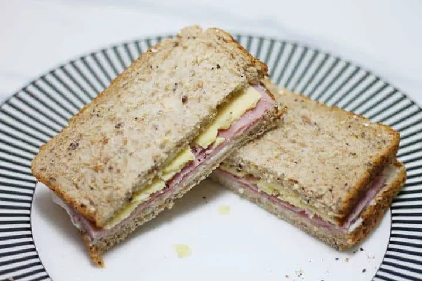
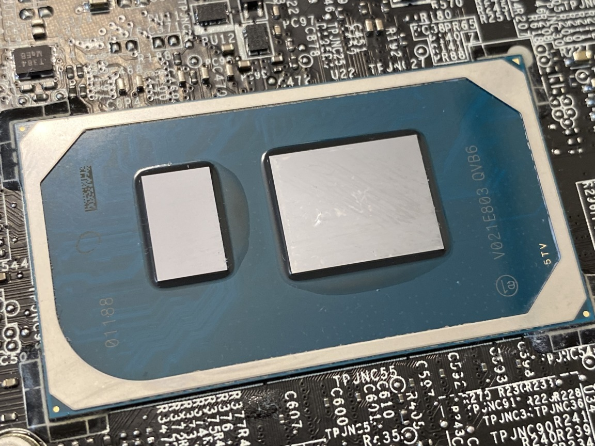
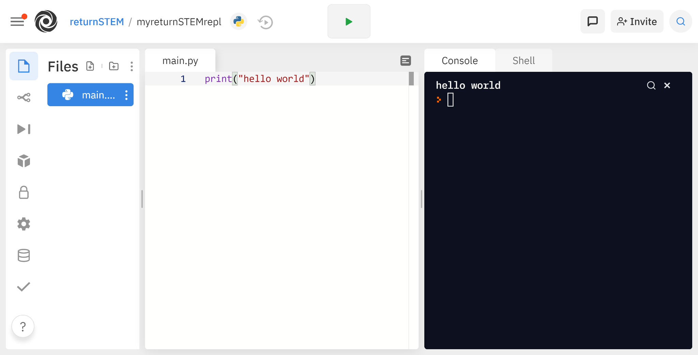

# What is programming?

Like all languages, a programming language communicates something (in this case, to the computer).

If we were to write out things to tell a person, it would look like this:

The format we communicate with the computer in is a text file, where we write out all the things we want a computer to do.

We can tell the computer information, make it do calculations, and display information back to us.

In this lesson, we will cover some of the fundamentals of computer science and a brief introduction to  __console output (displaying information).__

```
pick up a box
move it to the closet
repeat above steps four times
close the closet
```

## An analogy

* You’re coming home from school and  __you (the programmer)__  want  __your brother (the computer) to make ham and cheese sandwiches (the task) __ for you both 
* He doesn't know how to make a sandwich!
  * You write  __a recipe (the program)__  and send it to him
    * Looks something like this:
      * Toast four pieces of bread
      * Put two slices of ham on each bottom bread
      * Put one slice of cheese on top of the ham
      * Put the bread on top
      * Put it in the pan and melt the cheese
  * He reads the recipe
  * __If he understands it__ , he will make the sandwiches
    * If he doesn't, you'll need to edit the recipe and resend it to him



# The computer

Your program is run (executed) by your computer

The  __central processing unit (CPU)__  executes the individual instructions

The  __memory (RAM) __ holds short-term data (numbers, words, etc.) that the computer needs to remember

For example, if you told you to do 108900 + 12345 you would need to:

Remember the number 108900 (memory)

Remember the number 12345 (memory)

Remember that I told you to add them (memory)

Then actually add them.  (CPU)




* Program execution will be affected by several factors:
  * __How many steps your program has__
    * Complex programs take longer to run than a simple ones
  * __How fast your computer is__
    * Computers with faster CPUs can run programs more quickly
  * __How much memory your computer has__
    * Your computer constantly uses memory to store information, but sometimes it runs out and becomes slower.
    * Our cook needs enough counter space to hold containers for the ham, the cheese, and the plate with the sandwiches
    * If there is not enough counter space, he will have to put things back in the fridge immediately, taking more time

# What is Python?

* The programming language you will learn is called  __Python__
* __Python__  is very widely used, easy to learn, and very powerful
  * It is used by Instagram, Google, and Facebook, among many others
* Python is:
  * High-level: it can be used in massive projects with relative ease
  * General-purpose: can be used for almost everything
  * Easy to write
* Its  __syntax __ is simple and readable
* By the end of this course, you will be able to create your own projects in Python


# repl.it

* An IDE (Integrated Development Environment) is used to write code
* It contains a code editor, a file browser, and a console window, all in one program
* It also makes running the program much easier
* The IDE we will be using for this course is repl.it, which is an online IDE that can be run in your web browser
* Slides to set it up are here:
  * [https://returnstem.org/replit](https://returnstem.org/replit)



# Syntax

* When you write to a computer in a programming language, you are telling it to perform some specific task.
* Just like in real life, you can say the same thing in multiple languages:
  * Pick up the book (English)
  * Recoge el libro (Spanish)
* Even though they mean the same thing, they look very different
* You will learn specific way of writing instructions, but you can also go and learn other languages yourself to see other ways to do a similar task.
* Both of these code blocks output the same thing, but the code on top is written in Python and code on the bottom is written in C++ (another programming language).
```
i = 0
while i < 5:
	i += 1
print(“hello”)
print(“world”)
```

```
while (i < 5) {
	i++;
	cout << “hello” << endl;
}
cout << “world” << endl;
```

# Let’s write a program!

Let's try your first program:

Open up repl and type in
```
print("Hello World!")
```

What comes up in the console?

The print() function displays whatever is inside of the parenthesis.

Double quotes, or ", need to surround whatever you want to type out.

When you surround a something with "", you are creating something called a  __string__ .

For example, `print("hello world")` displays hello world ,but without the "".
```
print("Hello World!")

>>> Hello World!
```
You can use multiple print() statements on different lines, like this:

```
print("Good Morning!")
print("The sun is shining!")
print("The weather is great!")
>>> Good Morning!
>>> The sun is shining!
>>> The weather is great!
```


You can't put multiple print() statements on a single line

Every new print statement you use adds a  __new line__ .

You can print special characters and numbers, too, but you  __need to surround everything in "".__

# Comments

Code isn't always simple and easy to understand, especially if you are writing more complex structures and algorithms.

Comments are like notes in the program. They are ignored by the computer.

You can use them to show another programmer your code, give yourself credit, or describe/record an algorithm you have developed.

To declare a comment, put a `#` in front of your statement, and the computer will ignore it.
```
# This program was written on 11/1/2021 by Jason L.
print("Hello World")

# This is a comment. Python will ignore this statement.
print("Another statement") # You can also put a comment after a statement

>>> Hello World
>>> Another statement
```

# Try it yourself!

Now that you've learned print() statements and comments, write a program saying your name and one fact about yourself.

Record the date and credit yourself using a comment at the top of the program.

```
# Written on October 16 by Jason L

print("My name is Jason and my favorite color is orange.")
```
# Vocabulary

| Word | Definition |
| :-: | :-: |
| Computer program | A set of instructions that can be performed by a computer to accomplish a task |
| Central processing unit | Part of a computer that executes (does) instructions |
| Memory | Part of a computer that holds short-term data the computer needs to recall |
| Syntax | The textual requirements of a programming language |
| Python | General-purpose, high-level programming language used by Instagram, Google, and Facebook. |

# Python Concepts

| Concept | Description |
| :-: | :-: |
| print() function | Displays whatever is inside the parenthesis on the console |
| comment | A statement that is ignored by the interpreter |
